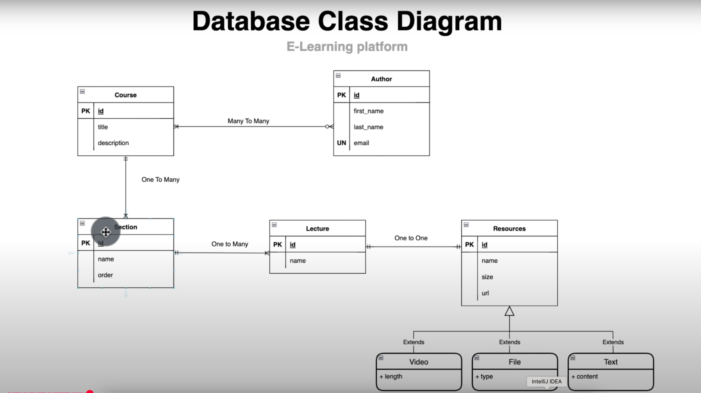
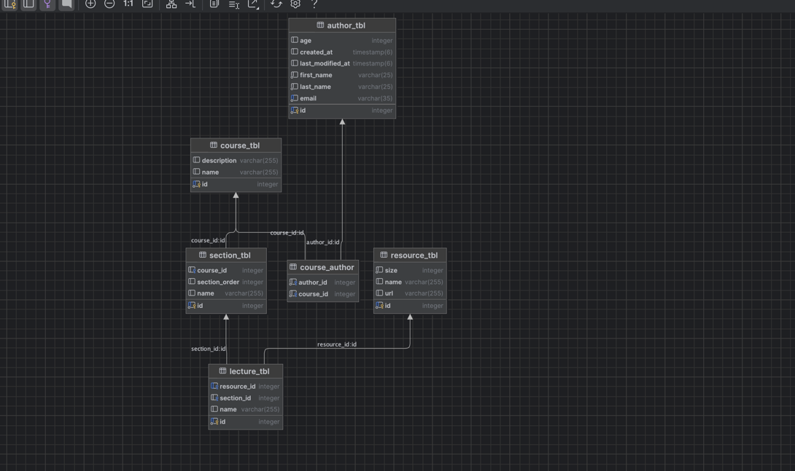
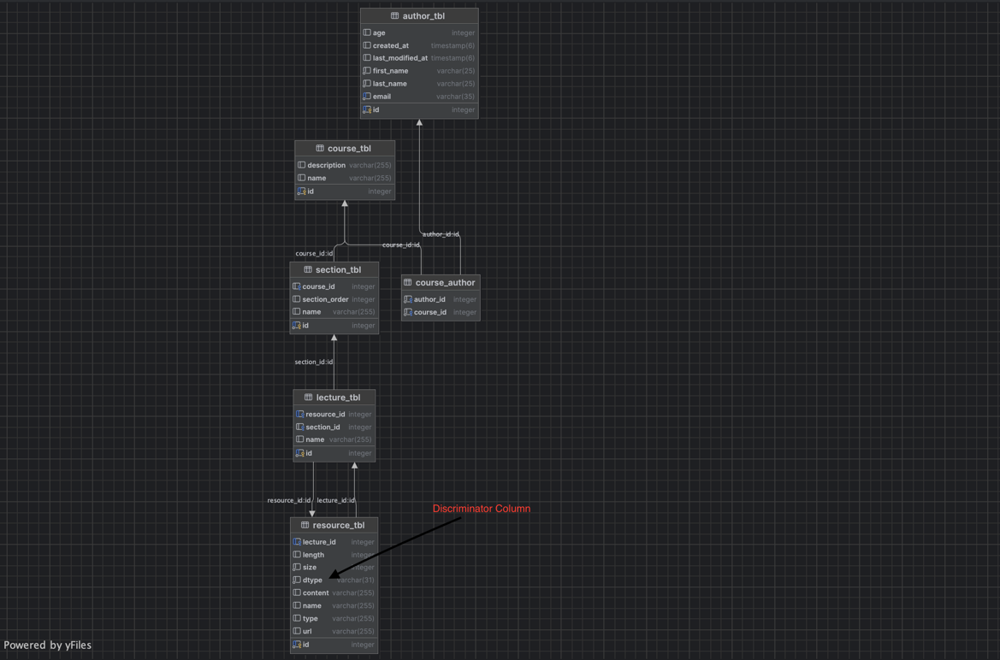
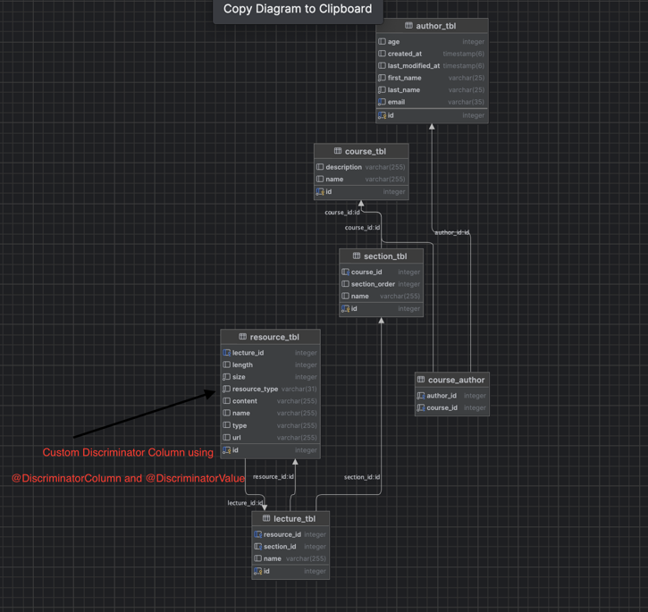

# Spring-Data-JPA-Hibernate

**Database UML diagram** 

**Docker Command to run postgres DB:**

`docker run -d \
--name my-postgres \
-p 5432:5432 \
-e POSTGRES_DB=appdb \
-e POSTGRES_USER=root \
-e POSTGRES_PASSWORD=root \
-v /Users/shubhamsharma/Documents/Git/Data-Volume:/var/lib/postgresql/data \
postgres:15`

**Database diagram with all the mappings.**

**_Default Discriminator Column_**

**_Custom Discriminator Column_**

